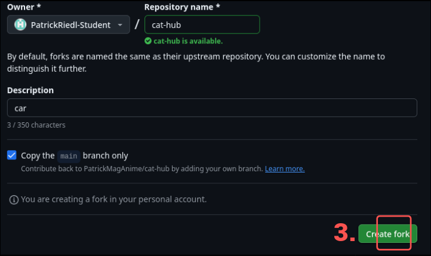
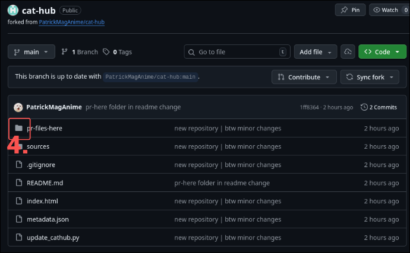
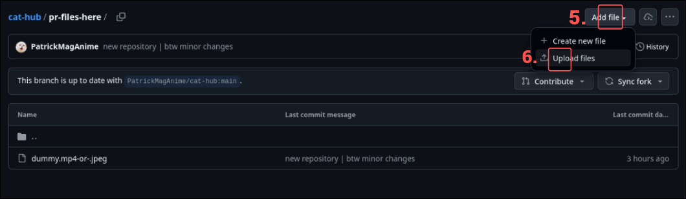
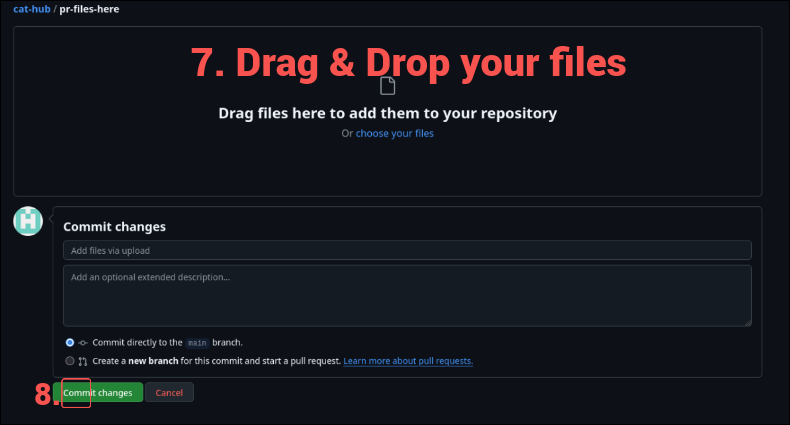
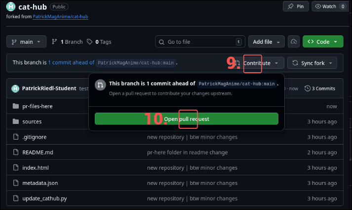
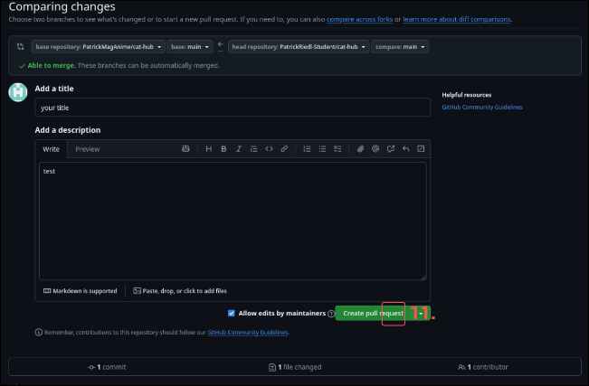

# Cat Meme Viewer

This repository contains a static, dark-themed, responsive cat meme gallery that displays images, GIFs and videos placed in the `sources/` directory. You can add media files to `pr-files-here/` via Pull Requests. 

## PR Guide
Step-by-Step guide. Rly self explaining:

